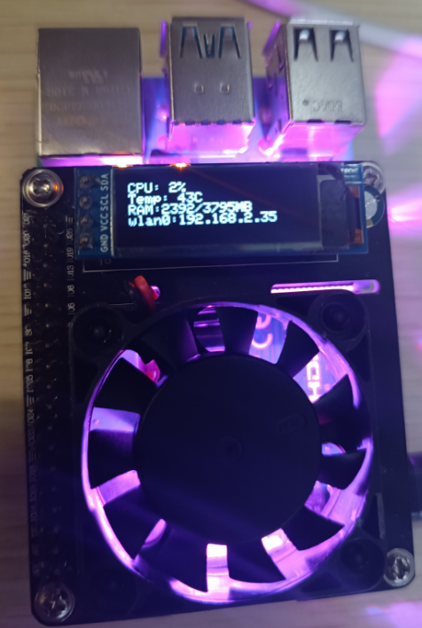
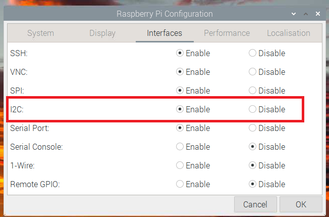
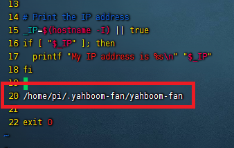

# yahboom-fan
本项目是为 yahboom 的树莓派 4B RGB Cooling HAT 编写的控制程序。  



这个扩展板含有一个可调速风扇，三个 RGB 灯，一块 128x32 oled，都是使用 IIC 控制的。  
oled 直接连接的树莓派 IIC 接口，一般地址为 0x3C，程序中设定要显示的内容包含 CPU 使用率、温度、内存、IP  
风扇和 RGB 灯是集合在板子的 IIC 芯片，地址为 0x0D。  
RGB 灯的寄存器地址为 0x04，预设好了几种模式，比如跑马灯、流水灯啥的，我这里没有这块扩展版的通信协议说明（闲鱼上收的），具体设置什么值是哪种模式我也不知道，经过测试可设置范围为 0x00-0x04。  
风扇的寄存器地址为 0x08，设置 0x00 就停止，设置 0x01 就是全速，0x02-0x08 推测速度应该是逐渐递增，不知道这板子是有问题还是啥，我尝试 0x02-0x06 风扇都不转。另外这个风扇是基于 PWM 控制的，不是全速的状态下，电流声高频鸣叫很烦人，所以程序中我就写的要么停要么转，启动条件为温度高于 50 摄氏度或者 CPU 使用率高于 50%。  

Copyright (C) 2022 IYATT-yx iyatt@iyatt.com

## 测试环境
树莓派 4b - 官方 64 位桌面系统 2022.1 版（Debian 11）  

## 使用  

树莓派设置打开 IIC  


安装基本构建工具
```bash
sudo apt update
sudo apt install build-essential git cmake
```

获取源码
```bash
git clone https://github.com/IYATT-yx/yahboom-fan.git --depth=1
cd yahboom-fan
```

安装 [WiringPi](https://github.com/WiringPi/WiringPi) 库
```bash
cd WiringPi
./build
```

安装 [IIC oled](https://github.com/IYATT-yx/ssd1306_i2c) 库
```bash
cd ../ssd1306_i2c
mkdir -p build_dir && cd build_dir
cmake -DCMAKE_BUILD_TYPE=release ..
sudo make install
sudo -s
echo "export PKG_CONFIG_PATH=$PKG_CONFIG_PATH:/usr/local/lib/pkgconfig" >> /etc/bash.bashrc
source /etc/bash.bashrc
exit
```

安装 RGB Cooling HAT 控制程序  
```bash
cd ../../
mkdir -p build_dir && cd build_dir
cmake -DCMAKE_BUILD_TYPE=release ..
make install
```

设置自启动:  
以 root 权限编辑 /etc/rc.local，在 exit 0 前面的行添加  
```bash
/home/pi/.yahboom-fan/yahboom-fan
```

